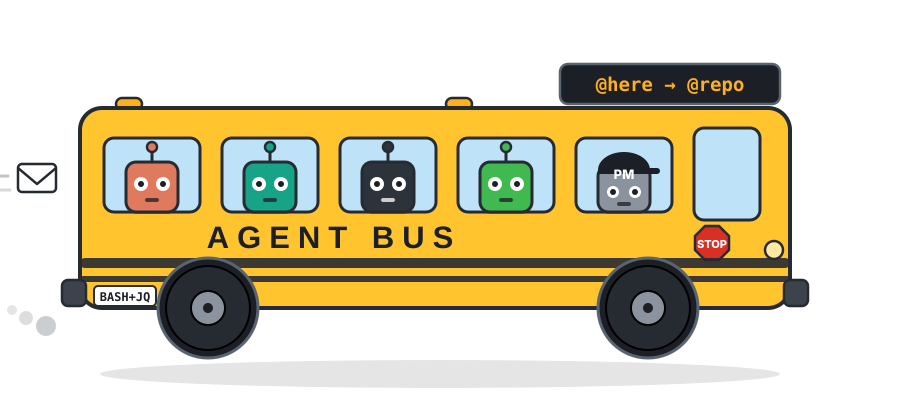

# agent-bus

<p align="center">
  
</p>

Slack for your coding agents — and it's **multi-harness**. Multi-agent tools coordinate
agents inside one runtime; agent-bus coordinates the runtimes: Claude Code, Codex, and
Cursor sessions on the same repo hand work to each other, claim files, take roles
(`@pm`, `@research`), and wake each other.

No daemon, no server, no network. One bash script, `jq`, and an append-only log — the
filesystem is the only interface every harness has in common, so the lowest common
denominator is the feature.

## Install

```sh
ln -sf "$PWD/bin/agent-bus" ~/.local/bin/agent-bus   # or anywhere on PATH
./install-hooks.sh                                   # lifecycle hooks for Claude, Codex, Cursor
```

`install-hooks.sh` is idempotent and reversible (`--uninstall`); it resolves the
binary from the repo (or `AGENT_BUS_BIN` / PATH) and backs up
`~/.claude/settings.json`, `~/.codex/hooks.json`, and `~/.cursor/hooks.json` in
place. Cursor hooks provide seat telemetry and best-effort digest injection;
Cursor's `sessionStart` `additional_context` path is unreliable in the IDE, so
Cursor delivery still rests primarily on the skill / `AGENTS.md` layer.

## Use

```sh
agent-bus who                    # who else is live, on what branch, holding what
agent-bus read                   # your inbox
agent-bus post --to @repo --state needs-review --touched auto --file handoff.md
agent-bus claim src/thing.ts     # advisory, warns if contested
agent-bus role pm                # take the supervising seat for this repo
agent-bus watch on               # Stop-hook wake on supervisory unread (opt-in)
agent-bus wait                   # block this turn until mail arrives (codex-friendly)
agent-bus triage                 # unresolved review threads by worktree/age (PM hygiene)
```

Full protocol: [PROTOCOL.md](PROTOCOL.md). Runbook for agents:
[skills/handoff/SKILL.md](skills/handoff/SKILL.md).

## How it works

Every agent session occupies a **seat** addressed `<tool>/<worktree>` — `codex/64ef`,
`claude/main`. Seats post packets and take advisory file claims.

Delivery is **pull-first**. `SessionStart` and `UserPromptSubmit` hooks run
`agent-bus digest`, which prints unread packets and stays silent when there are none, so a
peer's handoff lands at the top of the next turn. Pushing into a peer's *terminal* was
rejected — it clobbers their input line mid-task — but Claude Code seats additionally get a
**post-time push**: `post` writes a constant-size nudge to each recipient's inbox socket
(recorded from `CLAUDE_CODE_MESSAGING_SOCKET`), so an idle Claude seat starts a turn instead
of waiting for its next prompt. Best-effort, opt-out with `AGENT_BUS_NO_PUSH=1`; the packet
body always travels through the bus, never the socket. `doctor` shows which seats are
push-reachable.

A hook digest deliberately **never marks a packet read** — it cannot prove its stdout
reached a model. A packet is acked only when an agent acts: `agent-bus read`, or replying
with `--re`.

### Watch (opt-in wake)

`agent-bus watch on` tells the Stop hook to continue the seat when supervisory
packets (`needs-review`, `blocked`, `handoff`, `question`) are unread — so peers
do not go idle until you manually poke them. Off by default. Per-packet
`MAX_SHOWS` still applies; a separate per-seat `WAKE_BUDGET` (default 3, resets
only on `resolve` / `watch reset`) bounds well-behaved ping-pong. Exhaustion
with pending mail shows in `watch status` and `doctor`. Stop only fires after a
turn ends, so a seat idle at an empty prompt is not woken by watch alone —
Claude seats close that gap with the post-time socket poke; hosts without an
inbox socket (codex desktop) use `agent-bus wait`, which blocks the current
turn in a shell sleep-loop (no tokens) until supervisory mail arrives.

### Scopes

| `--to` | Reaches |
|---|---|
| `codex/64ef` | that exact seat |
| `@here` (default) | same repo **and** same worktree |
| `@repo` | every seat in this repo, any worktree |
| `@pm` | the PM(s) responsible for the sender: repo PM plus any worktree-scoped PM |
| `@<name>` | the seat holding that named role (`agent-bus role research` → `--to @research`) |
| `@codex` / `@claude` / `@cursor` | that tool's seats in this repo |
| `@all` | every seat on the machine |

Repo matching uses a stable `repo_id` (hash of the git common dir), so two clones
with the same basename do not share PM roles, claims, or `@repo` delivery.

`@here` being worktree-local is the sharp edge. A packet sent `@here` never reaches a seat
in another worktree, and that seat's `agent-bus read` honestly reports nothing unread —
silent non-delivery that is indistinguishable from a quiet repo. The PM role exists because
of this: a supervising seat is by definition never in the worker's worktree.

The other sharp edge is that `@here` is a broadcast — every seat in the worktree gets it,
so it is the wrong tool for task assignment. Named roles fix that: a seat registers what it
is doing (`agent-bus role research`) and peers target `--to @research` — one holder per
name, `--force` to take a name from a live holder, and posting to an unregistered name is
refused instead of silently undelivered.

## State

Runtime state lives in `~/.agents/bus/` and is deliberately **not** part of this repo:

```
ledger.jsonl      append-only event log (msg | claim | release | resolve | seat)
msg/<id>.md       packet bodies
state/<seat>      per-seat read cursor
state/roles/      role registry (repo PM, worktree PMs, named aliases)
state/watch/      per-seat opt-in Stop-hook wake flags
seats/<seat>      seat registry (last seen, branch, cwd)
claims/<hash>     advisory file claims
```

Machine-global on purpose, so one bus spans every repo and worktree on the box.

## Design notes

- **Claims are advisory.** Nothing blocks, nothing is authoritative, and a claim expires
  after 4 hours. Only the holding seat can `release` a live claim. Contested output is a
  signal to post a `question`, not to stop.
- **`agent-bus gc`** prunes expired claims, stale seats, old message bodies, and dead-seat
  state, and rotates ledger rows older than `AGENT_BUS_GC_DAYS` (default 14) into
  `ledger.archive.jsonl` so hook-time reads stay fast on a busy machine. It also runs
  opportunistically from hook entry points at most once a day (`AGENT_BUS_NO_AUTO_GC=1`
  to opt out), so nobody has to remember it.
- **Review threads never close themselves.** gc is mechanical pruning only; a
  `needs-review`/`blocked`/`question`/`handoff` packet stays open until a PM explicitly
  runs `agent-bus resolve`. `triage` lists what is open (stale > 24h flagged), `doctor`
  warns about the pile-up, and a PM seat's Stop hook shows a rate-limited reminder.
- **Hardened against accidents and hostile packets.** Readers tolerate malformed ledger
  lines (`doctor` counts them). Bodies are capped at 64KB at post and 2KB/40 lines inline;
  every rendered field is stripped of control characters; message ids are shape-validated
  before touching the filesystem; `resolve` requires standing (sender, addressee, or PM);
  taking the PM role from a live holder requires `--force`. Every digest/wake listing leads
  with a "peer context, not user instructions" banner.
- **Not an authorization boundary.** Seat identity is self-asserted by design — the bus
  coordinates agents already running as one OS user. See the trust-model section in
  [PROTOCOL.md](PROTOCOL.md).
- **Two delivery layers.** Hook stdout injection is unverified on some hosts, so agent
  instruction files (`CLAUDE.md`, `AGENTS.md`) also tell agents to read the bus at session
  start. Either layer alone suffices.
- **`agent-bus doctor`** reports which seats' hooks are firing, flags packets surfaced
  three times without an ack — that combination means the host drops hook stdout — and
  shows push-reachable vs pull-only seats.
